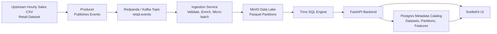
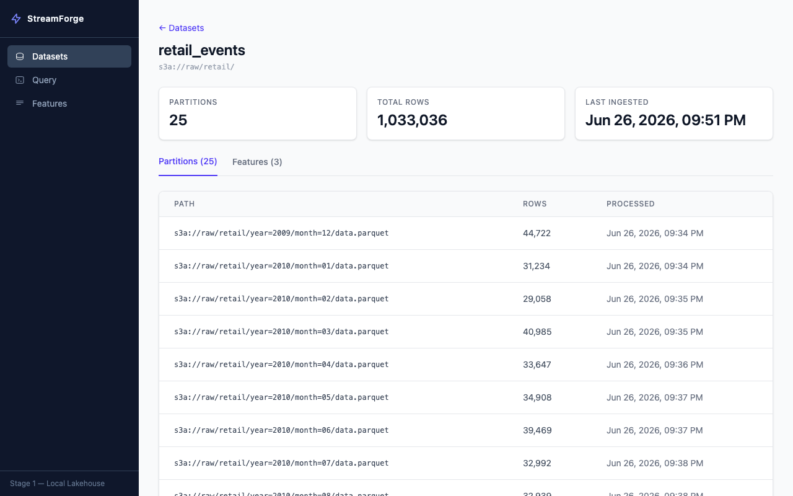
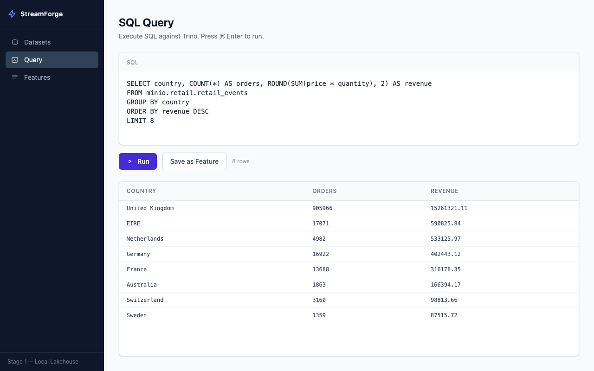
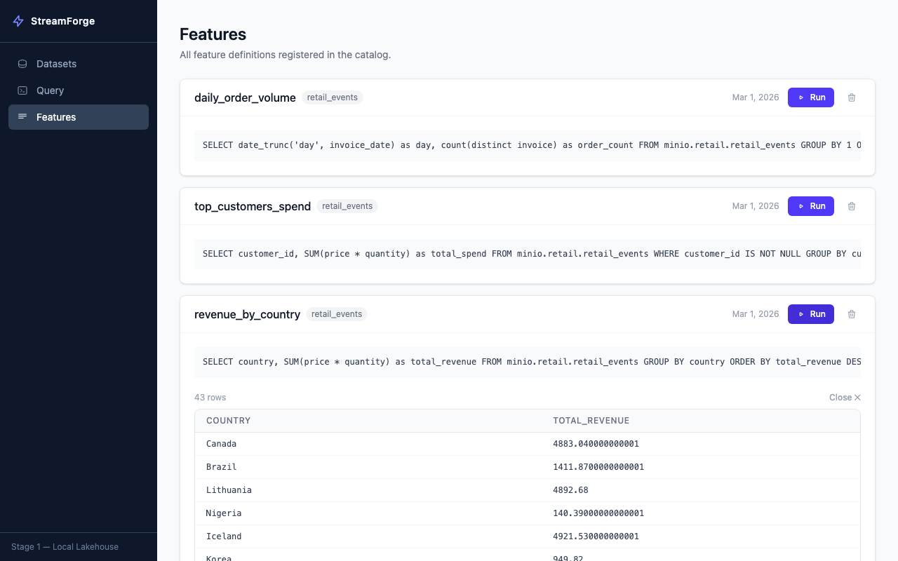

# StreamForge

**A fully local simulation of a modern streaming lakehouse** — event streaming, a Parquet data lake, a distributed SQL engine, a metadata catalog, and a feature registry, all running on your laptop with one command.

## Why

Modern data platforms combine Kafka-style event streams, object storage data lakes, distributed SQL engines (Trino/Snowflake), metadata catalogs, and feature engineering workflows. These systems are almost always cloud-based and expensive to spin up just to learn how the pieces fit together — there's no simple, local, open-source project that shows the full path data takes:

> upstream system → streaming ingestion → Parquet data lake → SQL query engine → feature registry & analytics UI

StreamForge recreates that path end-to-end using open-source tools, seeded with real transactional data (the [UCI Online Retail II](https://archive.ics.uci.edu/dataset/502/online+retail+ii) dataset), so you can see — and query — every stage of the pipeline. See [idea.md](idea.md) for the full design rationale.

## Architecture



A producer replays retail transactions as events into Redpanda. A consumer validates, micro-batches, and writes them as partitioned Parquet files to MinIO, registering each partition in a Postgres catalog. Trino queries that Parquet data directly via SQL. FastAPI exposes the catalog and query layer, and a SvelteKit UI lets you browse datasets, run SQL, and save/run named features — all backed by live data.

## See it in action

| Browse datasets & ingestion metrics             | Run ad-hoc SQL against Trino                | Save & run reusable features                |
| ----------------------------------------------- | ------------------------------------------- | ------------------------------------------- |
|  |  |  |

## Quick start

Requires [Docker Desktop](https://www.docker.com/products/docker-desktop/) (running) and `make`.

```bash
git clone https://github.com/iamhwkchn/streamforge.git
cd streamforge
make up      # downloads the dataset, builds and starts all 8 services
```

Then open **http://localhost:3000**. The producer and consumer start streaming immediately — refresh the dataset detail page after a few seconds to watch partitions and row counts climb in real time.

Other useful commands:

```bash
make ps      # check service status
make logs    # tail logs from every service
make test    # run the API and ingestion test suites
make down    # stop everything
make clean   # stop and wipe all persisted data (Postgres, MinIO, Trino catalog)
```

## Tech stack

| Component            | Technology           | Why                                                               |
| -------------------- | -------------------- | ----------------------------------------------------------------- |
| Event Stream         | Redpanda (Kafka API) | Kafka-compatible, single binary, no Zookeeper — fits on a laptop |
| Object Storage       | MinIO                | Local S3-compatible data lake                                     |
| Metadata Catalog     | Postgres             | Tracks datasets, partitions, and feature definitions              |
| Analytics Engine     | Trino                | Industry-standard distributed SQL engine for data lakes           |
| Backend API          | FastAPI              | Lightweight service layer for the UI and metadata catalog         |
| Frontend             | SvelteKit            | Fast, reactive UI for browsing data and running queries           |
| Data Format          | Parquet              | Columnar, lakehouse-standard storage format                       |
| ETL / Transformation | Polars               | Efficient CSV/XLSX → Parquet processing                          |

Full rationale for each choice is recorded in [pmo/adr/](pmo/adr/) (one ADR per major decision).

## Repository structure

```
apps/
  api/      FastAPI backend — metadata catalog + Trino query endpoint
  ingest/   Kafka producer & consumer (streaming ingestion)
  web/      SvelteKit frontend
ops/
  docker/   docker-compose.yml — local orchestration
  postgres/ schema + seed SQL, auto-run on first boot
  trino/    Trino catalog + coordinator config
scripts/    one-off bootstrap scripts (static lake seed, Trino validation)
docs/       design docs (metadata catalog, streaming ingestion pipeline)
pmo/        roadmap, charter, and architecture decision records (ADRs)
```

## Project status

| Stage                    | Goal                                                            | Status         |
| ------------------------ | --------------------------------------------------------------- | -------------- |
| 1 — Local Lakehouse     | Parquet lake, metadata catalog, SQL analytics, UI workbench     | ✅ Done        |
| 2 — Streaming Ingestion | Kafka producer/consumer, micro-batching, live ingestion metrics | ✅ Done        |
| 3 — Platform Simulation | Kubernetes manifests for every service                          | 🚧 In progress |

Full breakdown in [pmo/roadmap.md](pmo/roadmap.md).

## Further reading

- [idea.md](idea.md) — full problem statement, goals, and architecture rationale
- [pmo/charter.md](pmo/charter.md) — project scope and success criteria
- [pmo/adr/](pmo/adr/) — architecture decision records (why Redpanda over Kafka, Trino over Spark, etc.)
- [docs/metadata_catalog.md](docs/metadata_catalog.md) — catalog schema and registration flow
- [docs/streaming_ingestion.md](docs/streaming_ingestion.md) — producer/consumer design, crash recovery, idempotency

## License

[MIT](LICENSE)
