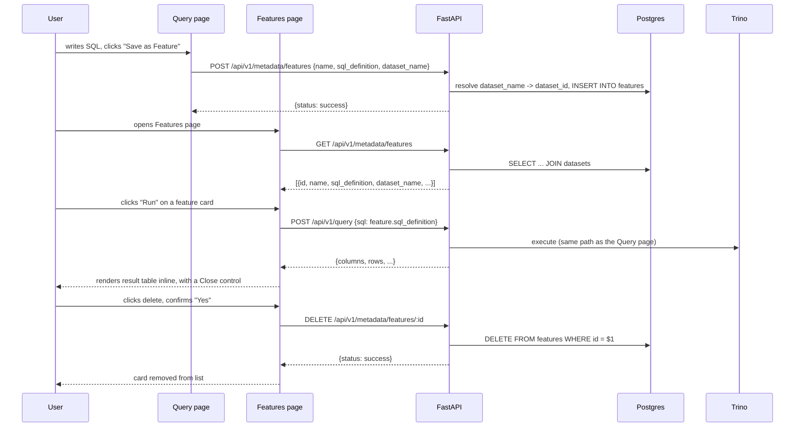

# Feature Registry Workflow (v1.0)

## 1. Abstract

The Feature Registry turns ad hoc SQL into named, reusable, shareable analytics: a user writes a query on the Query page, names it once, and from then on anyone can re-run it from the Features page without retyping or re-deriving the SQL. This document covers the full save → list → run → delete lifecycle as it spans the catalog (Postgres `features` table, see [metadata_catalog.md](metadata_catalog.md)), the query engine (Trino execution, see [query_engine.md](query_engine.md)), and the UI (see [frontend.md](frontend.md)). It exists separately from those three because the workflow itself — not any single layer — is the thing with its own design decisions.

---

## 2. Goals & Non-Goals

### Goals
* **Save what you just wrote**: "Save as Feature" persists the Query page's current editor contents, not a re-derived or re-validated version of it.
* **One execution path for stored and ad hoc SQL**: running a feature must use the exact same Trino execution code as running a typed query — no separate "feature executor."
* **Non-destructive exploration**: running or closing a feature's output must never affect other features' state, and must be reversible (closing just hides, it doesn't discard the feature).
* **Catalog-seeded, user-extensible**: the three SQL features seeded in `ops/postgres/02_seeding.sql` (`revenue_by_country`, `top_customers_spend`, `daily_order_volume`) and any user-saved feature are first-class and indistinguishable in the UI.

### Non-Goals
* **Versioning**: saving a feature with a name that already exists fails (unique constraint) rather than creating a new version. There is no edit-in-place; the workaround is delete-and-recreate.
* **Parameterized features**: `sql_definition` is a static string. There's no `{{customer_id}}`-style templating — every feature is fully self-contained SQL.
* **Scheduled / materialized features**: "Run" always executes live against Trino. Nothing is pre-computed or cached on a schedule.

---

## 3. End-to-End Flow

---

## 4. Detailed Design

### 4.1. Save

`POST /api/v1/metadata/features` ([router.py](../apps/api/api/v1/metadata/router.py) → `register_feature_in_db` in [services.py](../apps/api/api/v1/metadata/services.py)) resolves `dataset_name` to a `dataset_id` and inserts. Two handled failure cases, both returned as `{"status": "error", "message": ...}` with HTTP `200` (not a 4xx — see the error-shape convention in [CLAUDE.md](../CLAUDE.md)):

- **Unknown dataset** — `dataset_name` doesn't match any row in `datasets`.
- **Duplicate name** — `features.name` has a `UNIQUE NOT NULL` constraint; the insert is wrapped in `try/except asyncpg.UniqueViolationError` to turn a raw DB error into a clean message rather than a 500.

The UI's `createFeature()` ([api.ts](../apps/web/src/lib/api.ts)) inspects the response body for `status: "error"` and throws, so the Query page's save form can show the message without the user ever seeing a stack trace.

### 4.2. List

Two read paths exist for different scopes:

- `GET /api/v1/metadata/datasets/{id}/features` — features for one dataset, used on the dataset detail page's Features tab.
- `GET /api/v1/metadata/features` — **every** feature across all datasets, joined with `dataset_name` (`list_all_features` in services.py), used by the standalone Features page.

Both return the same shape plus `dataset_name` on the latter. There's no single "list features" function shared between them in the frontend — they're genuinely different queries answering different questions (see [frontend.md §4.5](frontend.md#45-features-features)).

### 4.3. Run

This is the workflow's central design decision: **running a feature is not a special operation.** The Features page's "Run" button calls `runQuery(f.sql_definition)` — the identical `lib/api.ts` function the Query page calls for a typed query, hitting the identical `POST /api/v1/query` endpoint, going through the identical read-only guard and pagination in `query/services.py` (see [query_engine.md §4.2-4.3](query_engine.md#42-the-read-only-guard)). A feature is, mechanically, just SQL that happened to get a name and a row in Postgres. This guarantees:

- A feature can never bypass the SQL safety guard, because there is no second code path that could omit it.
- Pagination/error-handling behavior (400 for bad SQL, 503 for Trino down) is identical whether the SQL came from a feature or was typed fresh.

Each feature's result is keyed by feature id in the Features page's local state (`resultsById`), so running several features leaves each one's output independently visible until explicitly closed.

### 4.4. Close (collapse output)

Closing a feature's result is purely a frontend state change — it deletes that feature's entry from `resultsById`/`errorsById`. No request is made. Re-opening means clicking Run again, which re-executes against live Trino (consistent with the no-caching goal above) rather than restoring a stashed result.

### 4.5. Delete

`DELETE /api/v1/metadata/features/{id}` ([services.py](../apps/api/api/v1/metadata/services.py) → `delete_feature_in_db`) is a straight `DELETE FROM features WHERE id = $1`, returning an error body if `asyncpg`'s `DELETE 0` indicates no row matched. The UI confirms in place (no modal — see [frontend.md](frontend.md) Alternatives) before calling it, and only removes the card from local state after the API confirms success.

---

## 5. Alternatives Considered

### Alternative: A dedicated "feature execution" endpoint (`POST /api/v1/metadata/features/{id}/run`)
* **Pros**: Could attach feature-specific telemetry (run count, last-run timestamp) without touching the generic query endpoint.
* **Cons**: Re-implements (or worse, half-duplicates) the read-only guard, pagination, and Trino error mapping that `query/services.py` already owns. Two places to keep a SQL safety invariant correct instead of one.
* **Decision**: Reuse `POST /api/v1/query` directly, passing `sql_definition` as the body, exactly as a hand-typed query would be sent. See §4.3.

### Alternative: Soft delete (`deleted_at` column) instead of a hard `DELETE`
* **Pros**: Recoverable; preserves history if something else ever referenced a feature by id.
* **Cons**: Nothing in v1 references a feature by id outside the features table itself; added a column and a `WHERE deleted_at IS NULL` everywhere for no current consumer.
* **Decision**: Hard delete. Revisit if/when something depends on feature history (e.g. an audit log — currently a non-goal, see [pmo/charter.md](../pmo/charter.md)).

### Alternative: Confirm delete via the browser's native `confirm()`
* **Pros**: Zero markup.
* **Cons**: Blocks the JS event loop, can't be styled, and doesn't fit the rest of the UI's inline-control pattern.
* **Decision**: Inline "Delete? Yes/No" rendered in place of the trash icon — see [frontend.md](frontend.md) Alternatives.
