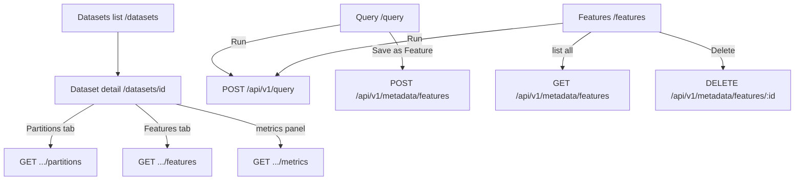

# Frontend / UI Workflows (v1.0)

## 1. Abstract

`apps/web` is a SvelteKit single-page app with three routes — Datasets, Query, Features — that together let a user explore the lake without writing infrastructure code: browse what's registered, run ad hoc SQL, and turn a useful query into a named, reusable feature. It talks to the backend exclusively through `lib/api.ts`, a thin typed wrapper over `fetch`. This document covers the UI's structure and workflows; the endpoints it calls are documented in [metadata_catalog.md](metadata_catalog.md) and [query_engine.md](query_engine.md).

---

## 2. Goals & Non-Goals

### Goals
* **No build step for talking to the API**: every route imports typed functions from `lib/api.ts` — no route constructs a `fetch` call directly.
* **Read-through UI**: every page reflects live catalog/Trino state on load; nothing is cached client-side across navigations.
* **Self-service feature creation**: a user should be able to go from "useful SQL query" to "named feature anyone can re-run" without leaving the browser.

### Non-Goals
* **Client-side routing guards / auth**: there is no login; every route is open, matching the no-auth posture of the API (see [pmo/charter.md](../pmo/charter.md) Non-Goals).
* **Offline / optimistic UI**: every action (save feature, delete feature, run query) waits for the server response before updating state; there's no optimistic update or local cache to reconcile.
* **Real-time push updates**: the dataset metrics panel reflects whatever the API returns on page load — it does not poll or subscribe for live updates while ingestion runs. Refresh to see new partitions land.

---

## 3. System Architecture

All three routes share one `+layout.svelte` — a fixed left sidebar (Datasets / Query / Features) with a stage-status footer, and a scrollable main panel. There is no shared app-level store; each route fetches what it needs in its own `onMount`.

---

## 4. Detailed Design

### 4.1. `lib/api.ts` — the only HTTP boundary

A single `request<T>(path, init)` helper wraps `fetch`, prefixes `/api/v1`, and throws `Error(detail)` on a non-2xx response. Every exported function (`getDatasets`, `getPartitions`, `getFeatures`, `getAllFeatures`, `getMetrics`, `runQuery`, `createFeature`, `deleteFeature`) is a thin call through it. Two of these — `createFeature` and `deleteFeature` — additionally inspect a `200`-with-`{"status": "error"}` body and re-throw, because the metadata API returns handled errors (unknown dataset, duplicate name, not found) as `200` rather than a 4xx — see the convention note in [CLAUDE.md](../CLAUDE.md).

Routes never read `fetch` or `/api/v1` directly. If a new endpoint is needed, it gets a typed function here first.

### 4.2. Routing & build

SvelteKit with `adapter-static` ([svelte.config.js](../apps/web/svelte.config.js), `fallback: 'index.html'`) — the app builds to static files and is served by nginx in production ([Dockerfile](../apps/web/Dockerfile)), which also reverse-proxies `/api/` to the FastAPI container ([nginx.conf](../apps/web/nginx.conf)). In dev, Vite's own proxy does the same thing (`vite.config.ts`). This is why `lib/api.ts` always uses a relative `/api/v1` base — the same code runs unmodified against either proxy.

### 4.3. Datasets (`/datasets`, `/datasets/[id]`)

The list page is a straight `getDatasets()` render. The detail page (`[id]/+page.svelte`) fires four requests in parallel via `Promise.all` (`getDatasets`, `getPartitions`, `getFeatures`, `getMetrics`) and renders a metrics panel (partition count, total rows, last ingested timestamp) above a Partitions/Features tab switcher. `getDatasets()` is called again here (not just once globally) to resolve the dataset's name/storage location by id — there's no shared dataset cache between routes.

### 4.4. Query (`/query`)

A `textarea` bound to `sql`, a Run button (`⌘/Ctrl+Enter` also triggers it) that calls `runQuery(sql)` and renders the column/row table, and a **Save as Feature** button that reveals an inline form (name + dataset picker, defaulting to the first dataset from `getDatasets()`). Saving calls `createFeature(name, sql, datasetName)` — the *current* editor contents, not the last-run query, so a user can save without running first. See [feature_registry.md](feature_registry.md) for what happens after save.

### 4.5. Features (`/features`)

Lists every feature across all datasets (`getAllFeatures()`, dataset shown as a badge), not scoped to one dataset like the detail-page tab in §4.3 — those two views deliberately serve different needs: the dataset page answers "what features exist for *this* dataset," the Features page answers "what features exist, period." Each card has:

- **Run** — calls `runQuery(f.sql_definition)` and renders the result table inline, keyed by feature id in a `resultsById` map so multiple features can have expanded output simultaneously.
- **Close ✕** — clears that feature's entry from `resultsById`/`errorsById`, collapsing the output without re-running anything.
- **Delete** (trash icon) — turns into an inline "Delete? Yes/No" confirm in place (no modal), calls `deleteFeature(f.id)` on confirm, and removes the card from local state on success.

---

## 5. Alternatives Considered

### Alternative: A global Svelte store for datasets/features
* **Pros**: Would avoid re-fetching `getDatasets()` on every route that needs it.
* **Cons**: Adds cache-invalidation problems (when does a store go stale after a feature is created elsewhere?) for a three-route app where every page already loads fast from a local Postgres/Trino.
* **Decision**: No global store. Each route fetches fresh on mount — simpler, and correctness over micro-optimization at this scale.

### Alternative: Modal dialogs for "Save as Feature" and delete confirmation
* **Pros**: Conventional, visually separates the action from the list.
* **Cons**: More component machinery (focus trapping, backdrop, portal) for actions that are one or two fields.
* **Decision**: Inline forms/confirms expand in place. Matches the rest of the UI's no-extra-dependencies approach (Tailwind utility classes only, no component library).

### Alternative: Route-level guard preventing "Run" on non-`SELECT` feature SQL
* **Pros**: Fail fast in the UI instead of round-tripping to the API for an obviously-bad feature definition.
* **Cons**: Would duplicate the read-only guard that already lives server-side in `query/services.py` (`_assert_read_only`) — see [query_engine.md](query_engine.md#42-the-read-only-guard).
* **Decision**: No client-side duplication. The UI just surfaces whatever 400 the API returns.
