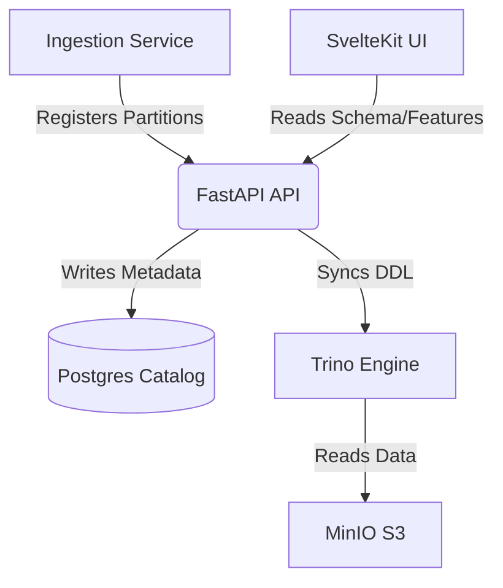

# Metadata Catalog (v1.0)

## 1. Abstract
The Metadata Catalog is the central brain of StreamForge. It bridges the gap between the physical storage (Parquet files in MinIO) and the logical query layer (Trino). This document defines the schema, the automation strategy via Docker, and the registration flow for datasets and features.

---

## 2. Goals & Non-Goals

### Goals
* **Dataset Agnosticism**: Support any columnar dataset dynamically.
* **Partition Awareness**: Enable Trino to perform partition pruning for performance.
* **Automated Bootstrapping**: Zero-touch database initialization using Docker.
* **Feature Consistency**: Provide a single source of truth for SQL-based business logic.

### Non-Goals
* **Multi-Tenancy**: We are not supporting multiple isolated users in this version.
* **Data Lineage**: While useful, tracking the full transformation graph is out of scope for v1.

---

## 3. System Architecture

The Catalog resides in Postgres and is orchestrated by the FastAPI backend.


---

## 4. Detailed Design

### 4.1. Automated Initialization Strategy
To ensure the environment is reproducible, we utilize the Postgres docker-entrypoint-initdb.d pattern.

* **Mechanism**: Mount ./ops/postgres/ to /docker-entrypoint-initdb.d/.
* **Ordering**: 
    1. 01_schema.sql: Table definitions.
    2. 02_seed.sql: Initial dataset registration (e.g., Online Retail dataset).

### 4.2. Data Model (Postgres)

#### Table: datasets
Tracks the root identity of data streams.
- id: UUID (PK)
```sql
    CREATE TABLE datasets (
        id UUID PRIMARY KEY DEFAULT gen_random_uuid(),
        name VARCHAR(255) UNIQUE NOT NULL, 
        storage_location VARCHAR(512) NOT NULL,
        created_at TIMESTAMP DEFAULT NOW()
    );
```

#### Table: partitions
- Maps time-based sub-folders to the dataset.
- Used for fast partition pruning in Trino.
- id: UUID (PK)
- dataset_id: FK -> datasets
```sql    
    CREATE TABLE partitions (
        id SERIAL PRIMARY KEY,
        dataset_id UUID REFERENCES datasets(id),
        partition_path VARCHAR(512) NOT NULL,
        row_count INTEGER,
        processed_at TIMESTAMP DEFAULT NOW()
    );
```
#### Table: features
- Stores the Gold Standard SQL for the Feature Store.
- Stores popular calculated metrics for the UI 
- This way we can give access to pre-computed metrics to users without giving them access to the raw data.
- name: Unique key (e.g., customer_spend_30d)
```sql    
    CREATE TABLE features (
        id UUID PRIMARY KEY DEFAULT gen_random_uuid(),
        name VARCHAR(255) UNIQUE NOT NULL,
        sql_definition TEXT NOT NULL,
        dataset_id UUID REFERENCES datasets(id),
        created_at TIMESTAMP DEFAULT NOW()
    );
```
---

## 5. Proposed Workflow

### 5.1. Registration Flow
1. **Detection**: consumer.py finishes writing a Parquet file to MinIO.
2. **Notification**: Consumer calls POST /api/v1/metadata/partitions.
3. **Persist**: API updates Postgres.
4. **Sync**: API executes CALL system.sync_partition_metadata('minio', 'raw', 'table_name') in Trino.

### 5.2. Query Flow
1. **Request**: UI asks for Top 10 Customers.
2. **Lookup**: API fetches the SQL from feature_registry.
3. **Execution**: API proxies the query to Trino.
4. **Response**: JSON results returned to the SvelteKit frontend.

---

## 6. Alternatives Considered

### Alternative: Hive Metastore (HMS)
* **Pros**: Industry standard for Spark/Trino.
* **Cons**: Extremely heavy, requires a separate database, Thrift service, and complex Java configuration.
* **Decision**: Use Postgres + FastAPI for a Lightweight Catalog to keep the project runnable on a laptop.

### Alternative: Manual Folder Scanning
* **Pros**: No database required.
* **Cons**: S3 LIST operations are slow and expensive; Trino wouldn't know when new data arrives.
* **Decision**: Active registration in Postgres is faster and more scalable.

---

## 7. Security & Persistence
* **Durability**: Postgres data is persisted via a named Docker volume postgres_data.
* **Access**: Only the api service communicates with the Catalog; the UI never talks to Postgres directly.