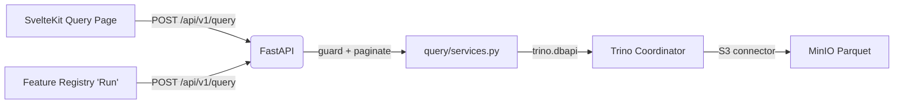

# Query Engine (v1.0)

## 1. Abstract

The Query Engine is the path between the SvelteKit UI and Trino. A single endpoint, `POST /api/v1/query`, accepts arbitrary SQL, wraps it for pagination and sorting, executes it against Trino, and returns a JSON page of results. It is intentionally separate from the Metadata Catalog (see [metadata_catalog.md](metadata_catalog.md)): the catalog tracks *what data exists*, the query engine answers *what does this SQL return right now*. Both the Query page and the Feature Registry's "Run" action go through this same endpoint.

---

## 2. Goals & Non-Goals

### Goals
* **One execution path**: every SQL string that reaches Trino — whether typed by a user on the Query page or stored as a feature's `sql_definition` — goes through the same guarded endpoint. No second, looser code path.
* **Read-only by construction**: the endpoint must reject anything that isn't a `SELECT`/`WITH` before it reaches Trino.
* **Server-side pagination**: large result sets (the lake has 1M+ rows per dataset) must never be fully materialized into a single HTTP response.
* **Predictable errors**: bad SQL and an unreachable Trino must be distinguishable to the caller (400 vs 503).

### Non-Goals
* **Query result caching**: every request re-executes against Trino. No materialized views or result cache in v1.
* **Cost-based query limits**: there's no timeout or row-scanned cap beyond what Trino itself enforces.
* **Write access**: there is no path for `INSERT`/`UPDATE`/`CREATE` — the lake is written only by the ingestion pipeline.

---

## 3. System Architecture



There is exactly one entry point (`router.py` → `execute_query`) regardless of which UI feature is calling it. This is deliberate: it means the SQL safety guard and pagination logic only need to be correct in one place.

---

## 4. Detailed Design

### 4.1. Request / Response Contract

`POST /api/v1/query` ([schemas.py](../apps/api/api/v1/query/schemas.py)):

```json
// Request
{ "sql": "SELECT country, COUNT(*) FROM minio.retail.retail_events GROUP BY country",
  "page": 1, "page_size": 1000, "sort_by": null, "sort_dir": "asc" }

// Response
{ "columns": ["country", "_col1"], "rows": [["United Kingdom", 905966], ...],
  "row_count": 8, "page": 1, "page_size": 1000, "has_more": false }
```

`page_size` is bounded `1..10000` at the schema level (`Field(ge=1, le=10000)`); there is no way to request an unbounded page.

### 4.2. The Read-Only Guard

Before anything touches Trino, `execute_query` strips a trailing `;` and runs `_assert_read_only`:

```python
_ALLOWED_STARTS = re.compile(r"^\s*(select|with)\s", re.IGNORECASE | re.DOTALL)
```

Anything that doesn't start with `SELECT` or `WITH` gets a `400` before a connection is even opened. This is the only thing standing between "UI lets you type SQL" and "UI lets you drop the lake" — any new code path that executes user-supplied SQL against Trino **must** call `_assert_read_only` first, rather than opening its own `trino.dbapi.connect`.

### 4.3. Pagination via Subquery Wrapping

Rather than asking Trino's connector for native pagination (the Hive/file connector has no stable cursor across requests), the engine wraps the caller's SQL as a subquery and applies `OFFSET`/`LIMIT` itself (`_build_paginated_sql`):

```sql
SELECT * FROM (
  <caller's SQL>
) AS __q
ORDER BY <sort_by> <sort_dir>   -- only if sort_by given
OFFSET <(page-1)*page_size>
LIMIT <page_size + 1>
```

Requesting `page_size + 1` rows and trimming back to `page_size` is how `has_more` is computed without a separate `COUNT(*)` query. `sort_by`, if present, is validated against `_SAFE_IDENTIFIER` (`^[a-zA-Z_][a-zA-Z0-9_]*$`) — it's interpolated directly into the SQL string, so it cannot be allowed to contain anything but a plain column name.

### 4.4. Connection Handling & Error Mapping

Each request opens a fresh `trino.dbapi.connect(...)` ([services.py](../apps/api/api/v1/query/services.py)) using `TRINO_HOST`/`TRINO_PORT`/`TRINO_CATALOG`/`TRINO_SCHEMA` from `core/config.py`, runs the query synchronously inside `asyncio.to_thread` (the `trino` Python client is blocking), and always closes the connection in a `finally`. Two distinct failure modes are surfaced differently:

| Failure | HTTP Status | Cause |
|---|---|---|
| Malformed SQL, unknown table/column, syntax error | `400` | `trino.exceptions.TrinoQueryError` caught explicitly |
| Trino unreachable, connection refused, timeout | `503` | any other exception, wrapped with `"Trino unavailable: {e}"` |

This distinction matters to the caller: a `400` means "fix your SQL," a `503` means "retry later, infrastructure is down" — the SvelteKit error banner shows the message verbatim either way, but a future client could branch on status code.

---

## 5. Alternatives Considered

### Alternative: Trino native `OFFSET`/`FETCH` without subquery wrapping
* **Pros**: No subquery indirection; slightly simpler generated SQL.
* **Cons**: Requires the caller's SQL to not already have its own `ORDER BY`/`LIMIT` that would conflict; wrapping is more robust to arbitrary caller SQL.
* **Decision**: Wrap in a subquery. It works regardless of what the inner query already does.

### Alternative: Separate endpoints for "run query" vs "run feature"
* **Pros**: Could attach feature-specific behavior (e.g., result caching by feature id) later.
* **Cons**: Two code paths means the read-only guard and pagination logic have to stay in sync by discipline, not by construction.
* **Decision**: One endpoint. The Feature Registry's "Run" button calls the exact same `POST /api/v1/query` with the feature's `sql_definition` as the body — see [feature_registry.md](feature_registry.md).

### Alternative: Allow-list of permitted tables instead of a SQL-prefix guard
* **Pros**: Tighter — could prevent querying arbitrary catalogs/schemas, not just DDL/DML.
* **Cons**: The lake is meant to be explored ad hoc (that's the point of the Query page); a table allow-list would have to be maintained as datasets are added.
* **Decision**: Guard on statement type only (`SELECT`/`WITH`). Table-level access control is a non-goal for v1 — see [Goals & Non-Goals](#2-goals--non-goals).

---

## 6. Configuration Reference

| Variable | Default | Description |
|---|---|---|
| `TRINO_HOST` | `localhost` | Trino coordinator host |
| `TRINO_PORT` | `8081` | Trino coordinator port (mapped from container's 8080) |
| `TRINO_USER` | `admin` | Trino session user (no auth enforced) |
| `TRINO_CATALOG` | `minio` | Default catalog (see [ops/trino/etc/catalog/minio.properties](../ops/trino/etc/catalog/minio.properties)) |
| `TRINO_SCHEMA` | `retail` | Default schema |

These are read once into `core/config.py:Settings` at process startup; the same pattern used by `apps/ingest` for its own env vars (see the note in [CLAUDE.md](../CLAUDE.md) about module-level constants and why tests must patch the constant, not `os.environ`, after import).
