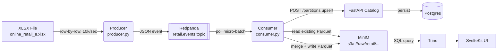

# Streaming Ingestion Pipeline (v2.0)

## 1. Abstract

The Streaming Ingestion Pipeline is the live data path of StreamForge. Where the bootstrap script loads a static snapshot of the Online Retail II dataset into MinIO once, the streaming pipeline replays that same dataset row-by-row through Redpanda (Kafka-compatible) to simulate a continuously active retail system.

The pipeline has three components: a **Producer** that reads the source XLSX and publishes one event per transaction, **Redpanda** acting as a durable ordered message buffer, and a **Consumer** that accumulates events into micro-batches, merges them with any existing Parquet partition, deduplicates, writes back to MinIO, and upserts each partition registration in the metadata catalog.

---

## 2. Goals & Non-Goals

### Goals
* **Event Semantics**: Each retail transaction is an independent, immutable Kafka message. One row = one message.
* **Fault Tolerance**: The consumer can crash and restart without losing or duplicating data. Offsets commit only after a successful write-and-register cycle.
* **Idempotent Partitions**: Running ingestion twice on the same data produces the same Parquet files and the same row counts in the catalog. Duplicate events are removed via `.unique()` at write time.
* **Decoupled Rate**: The producer and consumer operate at independent rates. The consumer controls micro-batch size; the producer doesn't care.
* **Local-first**: Everything runs on a laptop via Docker Compose. No cloud dependencies.

### Non-Goals
* **Schema Registry**: Message schemas are agreed upon implicitly. A formal Avro/Protobuf schema registry is out of scope.
* **Multiple Partitions / Parallelism**: Redpanda is configured as a single-node, single-partition setup for simplicity.
* **Row-level Lineage**: The consumer overwrites each Hive partition on every flush. Per-batch audit trails are out of scope.

---

## 3. System Architecture



---

## 4. Detailed Design

### 4.1. The Producer

The producer reads the full XLSX dataset into memory using Polars at startup, sorts rows by `invoice_date` ascending (oldest first), then iterates row by row, publishing each as a JSON event to the `retail.events` topic.

**Publish rate:** Controlled by `EVENTS_PER_SECOND` (default `100`, Docker Compose sets `10000`). The producer sleeps `1 / EVENTS_PER_SECOND` seconds between each send. At 10k/sec, the ~1.07M row dataset replays in roughly 2 minutes.

**Broker address:** Resolved from `REDPANDA_BROKERS` (default: `localhost:9092`). In Docker Compose this is overridden to `redpanda:29092` (internal listener).

**Message schema:**
```json
{
  "invoice":      "489434",
  "stock_code":   "85048",
  "description":  "15CM CHRISTMAS GLASS BALL 20 LIGHTS",
  "quantity":     12,
  "invoice_date": "2009-12-01T08:26:00",
  "price":        6.95,
  "customer_id":  "13085",
  "country":      "United Kingdom"
}
```

`customer_id` may be `null` (some transactions have no registered customer). All fields are serialized as strings in JSON; the consumer casts types on ingest.

### 4.2. Redpanda (Kafka)

Redpanda runs as a single-node broker with two listeners:

| Listener | Address | Used by |
|---|---|---|
| `PLAINTEXT` | `redpanda:29092` | Services inside Docker network (producer, consumer) |
| `OUTSIDE` | `localhost:9092` | Local dev tools (`rpk`, `kcat`) |

Topic `retail.events` is auto-created on first produce with Redpanda's default settings (1 partition, replication factor 1).

### 4.3. The Consumer

The consumer accumulates messages from `retail.events` into micro-batches and flushes when either:
- The batch reaches `BATCH_SIZE` records, or
- `BATCH_TIMEOUT_SECS` elapses — whichever comes first.

**Batch collection (`collect_batch`):**
The consumer polls in a tight loop with a 500 ms per-poll cap, accumulating messages across multiple poll calls until the batch limit or deadline is reached. The KafkaConsumer is configured with `max_partition_fetch_bytes=10MB` and `fetch_max_bytes=100MB` to allow large fetches when a backlog exists.

**Parsing (`parse_batch`):**
Raw JSON dicts are loaded into a Polars DataFrame with an explicit all-`Utf8` schema to avoid type inference failures when `customer_id` is null in early rows. Then:
- `quantity` → `Int64`
- `price` → `Float64`
- `invoice_date` → `Datetime` (format `%Y-%m-%dT%H:%M:%S`), rows with unparseable dates are dropped
- `year`, `month` columns derived from `invoice_date`

**Partition write (read-merge-append):**
The batch DataFrame is grouped by `(year, month)`. For each group:
1. Download the existing `retail/year=Y/month=MM/data.parquet` from MinIO (if it exists).
2. Concatenate existing + new rows, deduplicate with `.unique()`.
3. Write the merged DataFrame back to MinIO (overwrite).
4. `POST /api/v1/metadata/partitions` — the API upserts: new path → INSERT, existing path → UPDATE `row_count` + `processed_at`.

This makes ingestion **idempotent**: running the producer + consumer twice over the same data yields the same Parquet files and the same row counts.

**Object path convention:**
```
s3a://raw/retail/year={YYYY}/month={MM}/data.parquet
```

### 4.4. Offset Commit & Crash Recovery

`enable_auto_commit=False` — offsets are committed manually at the end of each batch loop, only after all partitions in the batch have been successfully written and registered. This guarantees:

- **No data loss**: uncommitted messages stay in Redpanda and are redelivered on restart.
- **At-least-once with idempotent writes**: if the consumer crashes after writing Parquet but before committing, the same rows are reprocessed. The read-merge-dedup pattern makes re-processing safe — `.unique()` removes any duplicates introduced by replay.

---

## 5. Alternatives Considered

### Alternative: Overwrite partition on each batch
Write each batch directly to MinIO without reading the existing file — simpler and faster, but loses previously ingested rows from the same `(year, month)` partition if the batch doesn't contain all of them.

* **Pros**: No MinIO read overhead per batch.
* **Cons**: Non-idempotent. Two consecutive batches covering the same partition will cause data loss on the first partition's data.
* **Decision**: Read-merge-append. The MinIO read overhead is acceptable at batch granularity and makes the pipeline safe to replay.

### Alternative: Batch ETL every 4 hours
Run a script on a cron schedule that extracts a delta, writes directly to MinIO — no Kafka needed.

* **Pros**: Much simpler. No broker to operate. Lower resource usage.
* **Cons**: Data latency is hours, not seconds. No replay capability. No decoupling between producer and consumer pace.
* **Decision**: StreamForge is explicitly a streaming lakehouse learning project. Kafka is the point.

### Alternative: Mini-batch per Kafka message (50–100 rows/message)
Pack multiple rows into a single JSON array per Kafka message.

* **Pros**: Reduces message count ~50–100x.
* **Cons**: Loses event semantics. Harder to replay individual events.
* **Decision**: One row per message. kafka-python batches internally on the wire anyway.

---

## 6. Configuration Reference

### Producer

| Variable | Default | Description |
|---|---|---|
| `REDPANDA_BROKERS` | `localhost:9092` | Kafka bootstrap servers |
| `DATASET_PATH` | `data/raw_datasets/online_retail_II.xlsx` | Source XLSX path |
| `EVENTS_PER_SECOND` | `100` | Publish rate (Docker Compose sets `10000`) |

### Consumer

| Variable | Default | Description |
|---|---|---|
| `REDPANDA_BROKERS` | `localhost:9092` | Kafka bootstrap servers |
| `MINIO_ENDPOINT` | `localhost:9000` | MinIO host:port |
| `MINIO_ACCESS_KEY` | `minioadmin` | MinIO access key |
| `MINIO_SECRET_KEY` | `minioadmin` | MinIO secret key |
| `MINIO_BUCKET` | `raw` | Target bucket |
| `API_BASE_URL` | `http://localhost:8000` | Metadata catalog base URL |
| `BATCH_SIZE` | `50000` | Max records per micro-batch |
| `BATCH_TIMEOUT_SECS` | `5` | Max seconds to wait before flushing |

---

## 7. Running the Pipeline

`producer`/`consumer` are gated behind the Compose `ingest` profile specifically so the platform (`make up`) and ingestion (`make ingest`) can be started, stopped, and restarted independently — see [Makefile](../Makefile) and the profile note in [CLAUDE.md](../CLAUDE.md).

### Fresh start (recommended)
```bash
make up       # platform: redpanda, minio, postgres, trino, api, web, redpanda-console
make ingest   # starts producer + consumer, streams the dataset in
make logs-ingest   # watch progress
```

Re-running `make ingest` at any point replays the dataset again — safe, since the consumer's read-merge-dedup write path makes re-ingestion idempotent (see §4.3).

### Verify
```bash
# Check consumer group lag (should reach 0 when done)
docker compose -f ops/docker/docker-compose.yml exec redpanda rpk group describe streamforge-consumer

# List Parquet partitions in MinIO
docker compose -f ops/docker/docker-compose.yml exec minio \
  sh -c 'mc alias set local http://localhost:9000 minioadmin minioadmin --quiet && mc ls --recursive local/raw/retail/'

# Check partition row counts via API
curl http://localhost:8000/api/v1/metadata/datasets/{id}/partitions
```

### Wind down
```bash
make down   # stops the platform and ingestion together
```
