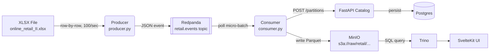

# Streaming Ingestion Pipeline (v1.0)

## 1. Abstract

The Streaming Ingestion Pipeline is the live data path of StreamForge. Where the bootstrap script loads a static snapshot of the Online Retail II dataset into MinIO once, the streaming pipeline replays that same dataset row-by-row through Redpanda (Kafka-compatible) to simulate a continuously active retail system.

The pipeline has three components: a **Producer** that reads the source XLSX and publishes one event per transaction, **Redpanda** acting as a durable ordered message buffer, and a **Consumer** (S2-E2) that accumulates events into micro-batches and writes them as Parquet files to MinIO, registering each partition in the metadata catalog.

---

## 2. Goals & Non-Goals

### Goals
* **Event Semantics**: Each retail transaction is an independent, immutable Kafka message. One row = one message.
* **Fault Tolerance**: The consumer can crash and restart without losing or duplicating data, using Kafka offset commits as its checkpoint.
* **Decoupled Rate**: The producer and consumer operate at independent rates. The consumer controls how large its Parquet micro-batches are; the producer doesn't care.
* **Local-first**: Everything runs on a laptop via Docker Compose. No cloud dependencies.

### Non-Goals
* **Exactly-once delivery**: We target at-least-once. Duplicate handling in the consumer is out of scope for Stage 2.
* **Schema Registry**: Message schemas are agreed upon implicitly. A formal Avro/Protobuf schema registry is out of scope.
* **Multiple Partitions / Parallelism**: Redpanda is configured as a single-node, single-partition setup for simplicity.

---

## 3. System Architecture



---

## 4. Detailed Design

### 4.1. The Producer

The producer reads the full XLSX dataset into memory using Polars at startup, sorts rows by `invoice_date` ascending (oldest first), then iterates row by row, publishing each as a JSON event to the `retail.events` topic.

**Publish rate:** `EVENTS_PER_SECOND = 100`. The producer sleeps `1 / EVENTS_PER_SECOND` seconds between each send. At 100/sec, the ~1M row dataset replays in roughly 3 hours — a realistic simulation of a busy retail day.

**Broker address:** Resolved from the `REDPANDA_BROKERS` environment variable (default: `localhost:9092`). When running in Docker Compose, this is overridden to `redpanda:29092` (internal listener).

**Message schema:**
```json
{
  "invoice":      "489434",
  "stock_code":   "85048",
  "description":  "15CM CHRISTMAS GLASS BALL 20 LIGHTS",
  "quantity":     12,
  "invoice_date": "2009-12-01T08:26:00",
  "price":        6.95,
  "customer_id":  "13085",
  "country":      "United Kingdom"
}
```

Fields map directly to the renamed columns from `scripts/bootstrap_lake.py`. `customer_id` may be `null` (some transactions have no registered customer).

### 4.2. Redpanda (Kafka)

Redpanda runs as a single-node broker with two listeners:

| Listener | Address | Used by |
|---|---|---|
| `PLAINTEXT` | `redpanda:29092` | Services inside Docker network (producer, consumer) |
| `OUTSIDE` | `localhost:9092` | Local dev tools (`rpk`, `kcat`) |

Topic `retail.events` is auto-created on first produce with Redpanda's default settings (1 partition, replication factor 1).

### 4.3. The Consumer (S2-E2 — not yet implemented)

The consumer accumulates messages from `retail.events` into micro-batches and flushes to Parquet when either:
- The batch reaches N rows (configurable, e.g. 500), or
- A time window elapses (e.g. 30 seconds)

After writing the Parquet file to MinIO, it calls `POST /api/v1/metadata/partitions` to register the new partition, then commits its Kafka offset. This is the checkpoint — a crash before the commit means the batch is reprocessed; a crash after means the partition is safely registered.

### 4.4. Offset Commit & Crash Recovery

Kafka consumer groups track offsets per topic-partition. On restart, the consumer resumes from the last committed offset. This means:
- **No data loss**: uncommitted messages stay in Redpanda and are redelivered.
- **At-least-once**: if the consumer crashes after writing Parquet but before committing, the same rows are reprocessed and a duplicate Parquet file may be written. Deduplication is a future concern.

---

## 5. Alternatives Considered

### Alternative: Batch ETL every 4 hours
Run a script on a cron schedule that extracts a delta (e.g. rows with `invoice_date > last_run`), writes directly to MinIO, and registers partitions — no Kafka needed.

* **Pros**: Much simpler. No broker to operate. Lower resource usage.
* **Cons**: Data latency is hours, not seconds. No replay capability. No decoupling between producer and consumer pace. No fan-out (a second consumer would need its own polling logic).
* **Decision**: StreamForge is explicitly a streaming lakehouse learning project. Kafka is the point.

### Alternative: Mini-batch per Kafka message (50–100 rows/message)
Pack multiple rows into a single JSON array per Kafka message instead of one row per message.

* **Pros**: Reduces message count ~50–100x. Lower per-message overhead.
* **Cons**: Loses event semantics. Consumer must unpack arrays before processing. Harder to replay individual events. Breaks the standard streaming pattern.
* **Decision**: One row per message. Kafka handles high message rates efficiently. kafka-python batches internally on the wire via `batch_size` and `linger_ms` anyway.

---

## 6. Configuration Reference

| Variable | Default | Description |
|---|---|---|
| `REDPANDA_BROKERS` | `localhost:9092` | Kafka bootstrap servers |
| `DATASET_PATH` | `data/raw_datasets/online_retail_II.xlsx` | Source XLSX path |
| `EVENTS_PER_SECOND` | `100` (code constant) | Producer publish rate |
