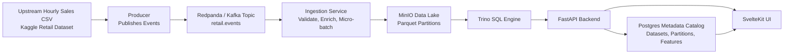

# StreamForge — Local Streaming Lakehouse with Feature Registry

## 1. Problem Statement

Modern data platforms rely on a combination of:

- Event streams (Kafka)
- Object storage data lakes (S3/ADLS/GCS)
- Distributed SQL engines (Trino/Presto/Snowflake)
- Metadata catalogs
- Feature engineering workflows
- Web-based analytics interfaces

However, these systems are typically cloud-based, complex, and difficult to understand end-to-end without access to production infrastructure.

There is no simple, local, open-source project that demonstrates how:

> data flows from upstream systems → through streaming ingestion → into a Parquet-based data lake → becomes queryable via a SQL engine → and is exposed through a feature and analytics UI.

**StreamForge** addresses this gap by recreating a realistic lakehouse architecture entirely locally using open-source technologies.

---

## 2. Context and Real-World Motivation

In real systems, datasets used for analytics do not originate as static CSV files. Instead:

- Upstream systems (ERPs, services, databases) produce hourly extracts or continuous event streams
- These events are published into Kafka
- Stream processors validate, enrich, partition, and convert the data into Parquet
- Parquet data lands in object storage (S3)
- Analytics engines query the lake for BI, dashboards, and feature engineering

This project simulates that real-world pattern locally.

We assume:

> Sales data is exported hourly as CSV from an upstream system and ingested through a streaming backbone before landing in the lake.

---

## 3. Dataset Used for Demonstration

### **[Online Retail II UCI](chatgpt://generic-entity?number=0)**

This dataset contains real transactional records from an online retail store between 2009–2011 and includes:

- Invoice number
- Product (StockCode, Description)
- Quantity
- Invoice timestamp
- Price
- Customer ID
- Country

This dataset is ideal because it naturally represents **event-based transactional data**, making it perfect for simulating streaming ingestion and lakehouse analytics.

Although the platform is designed to be dataset-agnostic, this dataset is used to demonstrate real customer analytics use cases.

---

## 4. Problems We Solve Using This Dataset

Using the lakehouse platform, we solve realistic business problems such as:

### Customer Analytics
- Who are the top customers by revenue in the last 30/60/90 days?
- How frequently do customers purchase?
- What is the recency of each customer’s last purchase? (RFM analysis)
- Which customers are likely to churn based on inactivity?

### Product Analytics
- Which products are trending in the last 7 days?
- What is the average basket size?
- What products are frequently purchased together?

### Revenue & Operational Insights
- Revenue over time (hourly/daily/monthly)
- Country-wise sales distribution
- Peak sales hours

### Feature Engineering Examples
Reusable SQL-based features such as:
- `customer_spend_last_30d`
- `orders_last_7d`
- `avg_basket_value_14d`
- `days_since_last_purchase`

These are defined in the feature registry and executed via Trino on lake data.

---

## 5. Goals

- Simulate a realistic lakehouse ingestion architecture locally
- Demonstrate how streaming ingestion feeds a Parquet-based data lake
- Maintain dataset and feature metadata in a catalog database
- Enable SQL-based analytics over lake data
- Provide a UI for dataset exploration, SQL querying, and feature definition
- Keep the system fully open-source and runnable on a laptop

---

## 6. Non-Goals

- Production-grade scalability
- Multi-node distributed deployment
- Authentication and multi-tenancy

---

## 7. High-Level Solution Overview

StreamForge recreates a simplified version of modern data platforms by combining:

1. **Streaming ingestion** of hourly sales data
2. **Micro-batching** into partitioned Parquet files
3. **Object storage** as the data lake
4. **A metadata catalog** to track datasets and partitions
5. **A distributed SQL engine** to query lake data
6. **A web UI** for analytics and feature exploration

---

## 8. Technology Stack and Rationale

| Component | Technology | Rationale |
|---|---|---|
| Event Stream | Redpanda (Kafka API) | Simulates real-time ingestion backbone |
| Object Storage | MinIO | Local S3-compatible data lake |
| Metadata Catalog | Postgres | Stores datasets, partitions, features, saved queries |
| Analytics Engine | Trino | Industry-standard SQL engine for data lakes |
| Backend API | FastAPI | Lightweight service layer for UI and metadata |
| Frontend | SvelteKit | Fast, reactive UI for analytics dashboards |
| Data Format | Parquet | Columnar, lakehouse standard |
| ETL / Transformation | Polars (Python) | Efficient CSV → Parquet processing |

---

## 9. Data Ingestion Model

### Simulated Real-World Scenario

- An upstream system exports sales data every hour as CSV
- A producer reads this CSV and publishes rows to a Kafka topic
- A stream consumer:
  - Validates and enriches records
  - Micro-batches records
  - Writes partitioned Parquet files into MinIO
  - Registers partitions in Postgres

This mirrors how real data platforms ingest data from operational systems.

---

## 10. Metadata and Catalog Design

Postgres acts as a lightweight metadata catalog storing:

- Registered datasets
- Schema information
- Parquet partition locations
- Feature definitions (SQL snippets)
- Saved queries

The UI and API rely entirely on metadata instead of hardcoded dataset logic, enabling the system to evolve toward dataset-agnostic ingestion.

---

## 11. Analytics and Query Layer

Trino queries Parquet data directly from MinIO using an S3 connector.

All analytics, dashboards, and feature previews are powered by Trino SQL queries.

---

## 12. Feature Registry Concept

Users can define reusable SQL-based features such as:

- Customer spend in the last 30 days
- Orders in the last 7 days
- Average basket value

These feature definitions are stored and versioned in Postgres and executed through Trino.

---

## 13. UI and User Workflows

The SvelteKit UI enables users to:

- Browse registered datasets
- Preview schemas and sample rows
- Execute ad-hoc SQL queries
- Define and preview features
- View analytics dashboards
- Monitor ingestion metrics

---

## 14. What This Project Demonstrates

This project demonstrates understanding of:

- Lakehouse architecture
- Streaming ingestion patterns
- Parquet-based data storage
- Metadata catalog design
- SQL-driven analytics engines
- Feature engineering workflows
- Full-stack data platform integration

---

## 15. Future Evolution

Although initially built for a retail dataset, the architecture is designed to evolve into a dataset-agnostic lakehouse where any CSV dataset can be ingested, registered, and queried with minimal changes.

---

## 16. Deployment and Orchestration Strategy

StreamForge is designed to run entirely locally while simulating a production-style deployment architecture.

To balance developer experience with infrastructure realism, the project supports two deployment modes:

### 16.1 Docker Compose (Primary Development Mode)

Docker Compose is used as the default local orchestration mechanism.

This provides:

- Simple startup with `make up`
- Persistent volumes for stateful components
- Minimal setup complexity
- Fast iteration during development

Stateful services using persistent volumes:
- Postgres (metadata catalog)
- MinIO (object storage)
- Redpanda (event log storage)

Stateless services:
- Trino
- FastAPI
- SvelteKit UI

This mode prioritizes accessibility and reproducibility.

---

### 16.2 Kubernetes Deployment (Production Simulation Mode)

To simulate real-world orchestration environments, StreamForge also includes optional Kubernetes manifests.

This mode demonstrates understanding of:

- Container orchestration
- Stateful workloads
- PersistentVolumeClaims (PVC)
- Service abstraction
- Deployment vs StatefulSet patterns

#### Kubernetes Resource Mapping

| Component | Kubernetes Resource Type |
|------------|--------------------------|
| Postgres | StatefulSet + PVC |
| MinIO | StatefulSet + PVC |
| Redpanda | StatefulSet + PVC |
| Trino | Deployment |
| FastAPI | Deployment |
| SvelteKit UI | Deployment |
| Internal networking | ClusterIP Services |
| Optional external access | Ingress |

PersistentVolumes ensure that:

- Database state survives pod restarts
- Object storage data remains durable
- Kafka logs are preserved

This mirrors how production data platforms are deployed in cloud environments.

---

### 16.3 Why Both Deployment Modes Exist

| Mode | Purpose |
|------|---------|
| Docker Compose | Fast local development and easy demo |
| Kubernetes | Demonstrates platform engineering knowledge |

This dual deployment strategy highlights:

- Developer productivity awareness
- Infrastructure orchestration knowledge
- Understanding of stateful vs stateless workloads
- Production-style system thinking

---

### 16.4 Persistence Model

Durability is achieved through:

- PersistentVolumes (Kubernetes mode)
- Named Docker volumes (Compose mode)

Deleting containers or pods does not remove data unless volumes are explicitly removed.

This ensures reproducibility and stable local experimentation.

---

## 17. Architectural Maturity Roadmap

The project evolves across three stages:

### Stage 1 — Local Lakehouse (Compose + Batch Seed)
- Partitioned Parquet lake
- Metadata catalog
- SQL analytics
- UI workbench

### Stage 2 — Streaming Ingestion
- Redpanda ingestion
- Micro-batching
- Partition registration
- Ingestion metrics

### Stage 3 — Platform Simulation
- Kubernetes orchestration
- StatefulSets and PVCs
- Service abstraction
- Production-style architecture

This staged evolution mirrors how real data platforms are incrementally built.

---

## 18. What This Project Ultimately Represents

StreamForge is not a dashboard project.

It is a local simulation of a modern data platform that demonstrates:

- Streaming ingestion patterns
- Lakehouse storage architecture
- Metadata-driven querying
- SQL-based feature engineering
- Platform-level orchestration
- Full-stack integration

It showcases both:

- Data engineering depth
- Systems design maturity